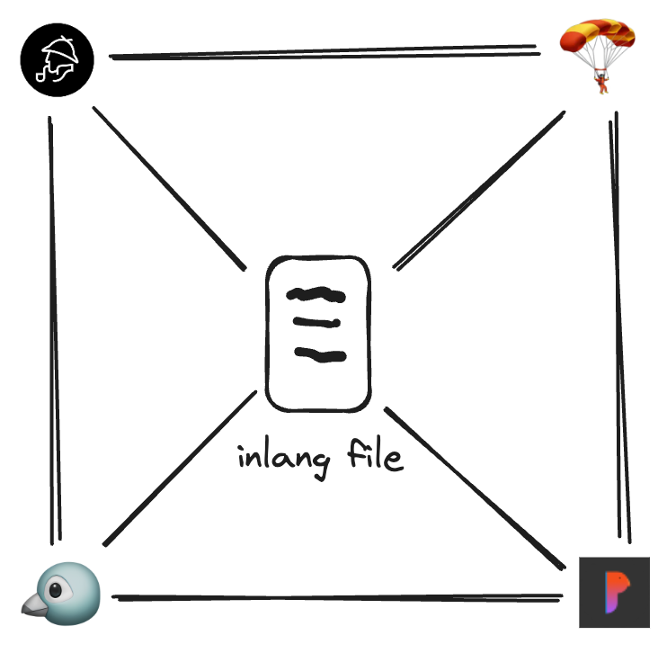
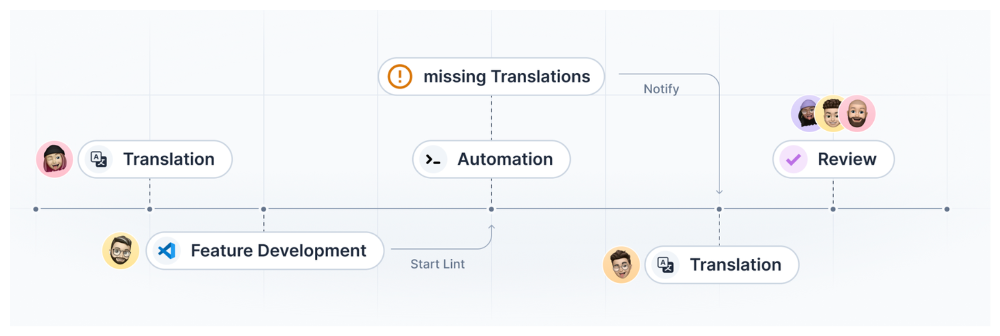

## What is Inlang?

### Standard open file format for i18n

Inlang is an **open file format** for internationalization (**i18n**) that provides an **SDK** for building and integrating localization tools on top of that open file format.

By defining a standardized file format for i18n, inlang enables interoperability between i18n solutions (translation management apps, developer tools, etc.).

### SDK for building i18n solutions

The inlang file format has an official **[SDK](https://inlang.com/c/sdk)** that allows you to create, read, and query inlang files programmatically.

Go to the [SDK docs](https://github.com/opral/inlang-sdk) for more information.

## Ecosystem

### 👨‍💻 Developer tools

Adopting the Inlang format gives you access to an ecosystem of **[apps](https://inlang.com/c/apps), [plugins](https://inlang.com/c/plugins)** that work together seamlessly. Popular tools already built on Inlang include:

- **[ParaglideJS](https://inlang.com/m/gerre34r/library-inlang-paraglideJs)** – A lightweight i18n library optimized for developer experience.
- **[Fink](https://fink2.onrender.com/)** – A powerful translation management tool for developers and translators.
- **[Sherlock i18n](https://marketplace.visualstudio.com/items?itemName=inlang.vs-code-extension)** – A VS Code extension that provides real-time translation linting and suggestions.

### 🧑‍🎨 Design tools

###
